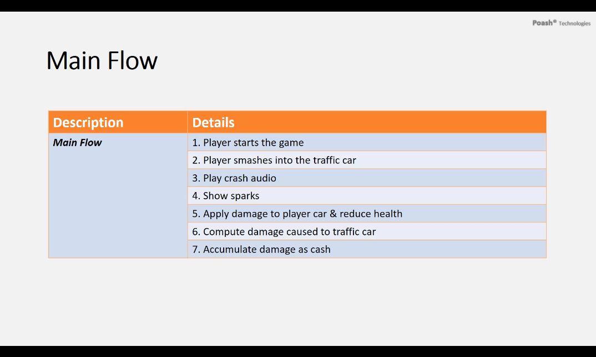
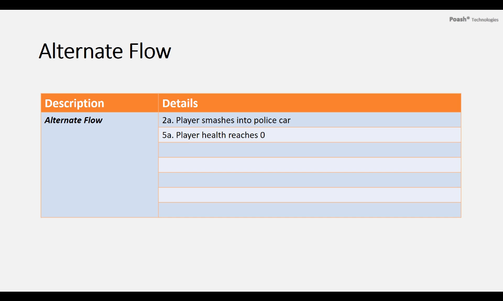
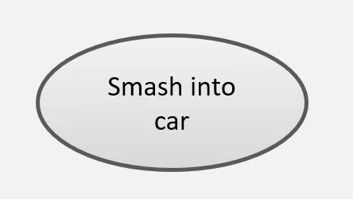
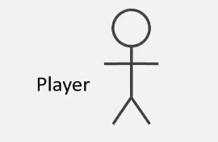

# Use Case

- Defines a model of a system behavior.
- Uses natural language.
    - Designers and programmers use as a common reference.
- Decomposes large system specification into small manageable parts.
- Smaller parts are easily described, hence easily implemented.
- Models functional behavior of the system.

## Use Case Description

1. Goal
    - Use Case's place within the system and why it is important.
2. Preconditions
    - What is required before use case execution.
3. Successful End Condition
    - System condition after successful execution.
4. Failed End Condition
    - System condition after failed execution.
5. Primary Actors
    - Actors that may trigger the use case.
6. Secondary Actors
    - Actors that participate but are not main players in a use case's execution.
7. Trigger
    - Event that causes the use case to execute.
8. Main Flow
    - Important steps in a use case's normal execution.
9. Extensions
    - Alternative steps in use case execution.

### Use Case Example

- Main Flow

- Alternate Flow

### Summary

1. UML is used for object oriented analysis.
2. It is a formal and standardized language.
3. It uses notations to describe the system.
4. Use case description is used to model system behavior.
5. Uses natural language.

## UML Use Case Syntax 

1. Use Case Diagram

- Describes a discrete unit of behavior that has a clearly defined scope. 
- Illustrates what should be done to achieve the goal of the use case.
- This maps into program code.
- Shown as an oval shape with the description of the behavior.
- Always triggered by an external entity.

2. Actor

- External entity interacts with the system.
- Could be a person, system or some external entity.
- May be defined outside the system. 
- Acts as a black box and cannot be changed. 
- Appears as a stick figure 

