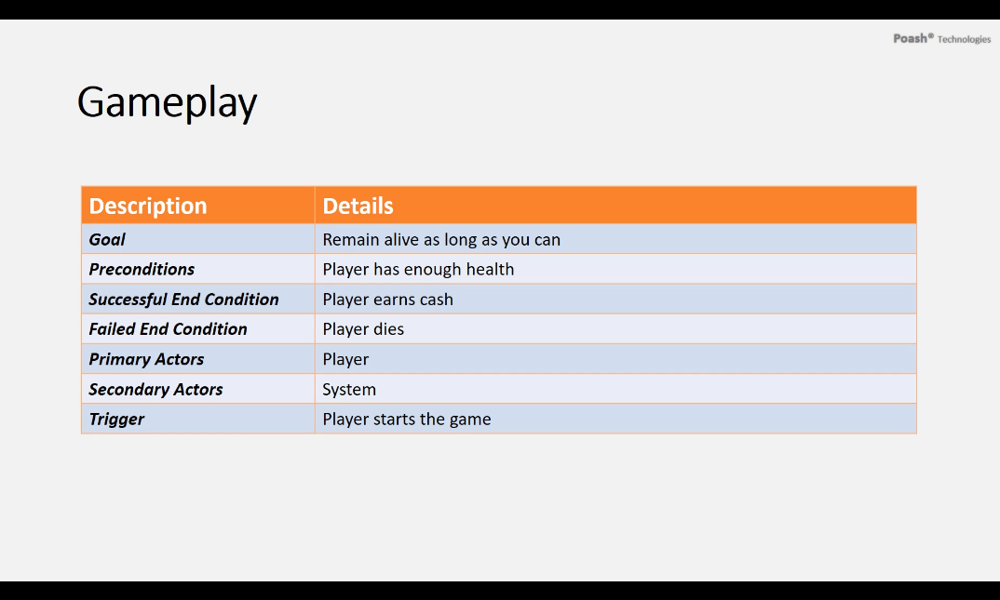
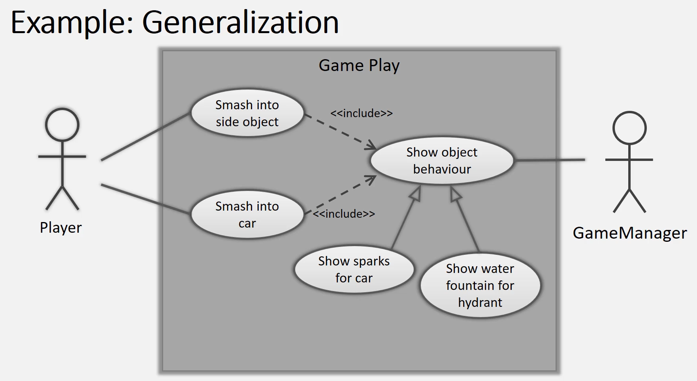

# Use Case

## Table of Contents

- [Use Case Description](#about)
- [Getting Started](#getting_started)
- [Usage](#usage)
- [Contributing](../CONTRIBUTING.md)

## Use Case Description
- List of steps a system needs to follow to reach a goal
    - Defines what is required and how those requirements are met.
    - Don't try to write code in a Use Case Diagram.
    - Shall vs Should Requirements
- These steps normally include interactions with an actor. 
- Uses natural language.
    - Designers and programmers use as a common reference.
- Decomposes large system specification into small manageable parts.
- Smaller parts are easily described, hence easily implemented.
- Models functional behavior of the system.

## Use Case Usage

1. Goal
    - Use Case's place within the system and why it is important.
2. Preconditions
    - What is required before use case execution.
3. Successful End Condition
    - System condition after successful execution.
4. Failed End Condition
    - System condition after failed execution.
5. Primary Actors
    - Actors that may trigger the use case.
    - Displayed on left side of diagram.
6. Secondary Actors
    - Actors that participate but are not main players in a use case's execution.
    - Displayed on right side of diagram.
7. Trigger
    - Event that causes the use case to execute.
8. Main Flow
    - Important steps in a use case's normal execution.
9. Extensions
    - Alternative steps in use case execution.

### Use Case Example

- Main Flow

- Alternate Flow

### Summary

1. UML is used for object oriented analysis.
2. It is a formal and standardized language.
3. It uses notations to describe the system.
4. Use case description is used to model system behavior.
5. Uses natural language.

## UML Use Case Syntax 

1. Use Case Diagram

    - Describes a discrete unit of behavior that has a clearly defined scope. 
    - Illustrates what should be done to achieve the goal of the use case.
    - This maps into program code.
    - Shown as an oval shape with the description of the behavior.
    - Always triggered by an external entity.

    

2. Actor

    - External entity interacts with the system.
    - Could be a person, system or some external entity.
    - May be defined outside the system. 
    - Acts as a black box and cannot be changed. 
    - Appears as a stick figure 
    
    

3. Communication Line

    - Connects an actor and a use case.
    - Indicates participation of an actor. 
    - Appears as a line between an actor and the use case. 

      

4. System Boundaries

    - Indicates separation between actors and use cases  (internal to the system.)
    - Marked by a bounded box around the use cases. 

      

## Use Case relationships

1. Some use similar steps in their behavior.
2. Others may have different modes or special cases.
3. Depicting such use cases may cause users to repeat them in diagrams.
4. This will lead to large and complicated diagrams.
5. UML provides different notations for representing these behaviors.

### <<include>> Relationship

1. A Use case may reuse all the steps from another use case.
    - It "includes" the steps from another use case.
2. This can be depicted through *<<include>>* relationship.
3. In diagram, shown as a dashed arrow between use cases with *<<include>>* label.
    - Tail end is towards the use case the reuses the steps.
    - Arrow end points towards the use case that is reused. 
4. Included use cases are mandatory not optional.

### Generalization Relationship

1. Used to show that one use case is a type of another, but with some changes.
2. Depicted through the generalization arrow.
    - Arrow head points to generalized use case.
    - Tail points to specialized use case.

#### Generalization Examples

### <<extend>> Relationship

1. Used to specify an optional behavior.
2. Appears as an extended use case.
3. Independent of the main use case, but owned by it.
4. Shown as a dashed arrow with <<extend>> label.
5. Optional 

#### <<extend examples>>

